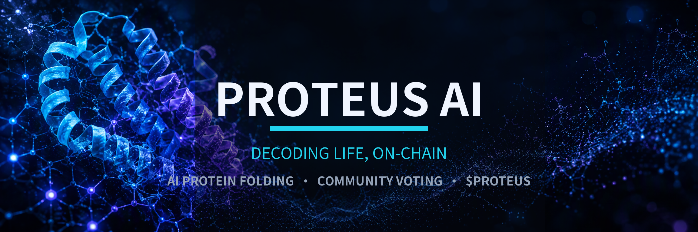

<div align="center">



# AI PROTEUS

**Decentralized protein-folding intelligence. The community votes — the AI builds.**

[](https://proteusai.space)
[](https://x.com/ai_proteus)
[](https://scienceprotein.github.io/proteus-ai/)
[](https://react.dev)
[](https://www.typescriptlang.org)
[](https://threejs.org)

</div>

---

## What is AI PROTEUS?

AI PROTEUS is a gamified, science-first platform where the community directs
AI-driven protein research. Each round presents three molecular hypotheses —
holders burn **$AIPROTEUS** to vote, the winning hypothesis enters the Arena,
and an AI folding pipeline (ESMFold + Rosetta-style refinement) computes the
structure in real time. Results are hashed on-chain and minted as NFTs.

> Decoding life through decentralized intelligence.

## Platform

### 🔬 Molecular Lab
Interactive 3D explorer with **real experimentally-determined structures** from
the RCSB Protein Data Bank. Rotate, zoom and click any atom, then launch the AI
agent on a single residue or the full structure.

- Live PDB fetching (`1CRN`, `1UBQ`, `1LYZ`, `4HHB`, `6VXX`, …)
- Real-time **ESMFold** predictions via the ESM Atlas API (pLDDT coloring)
- AI agent simulation: ΔΔG scans, SASA, secondary structure, mutation analysis
- Custom WebGL renderer — instanced atoms, computed bonds, Cα trace

### ⚔️ Arena
Burn-to-vote rounds on molecular hypotheses. The winning variant enters the
Arena where the GPU cluster folds it live while the community watches.

### 🎨 Generator
Procedural protein-art engine. Tune helix/sheet ratios and residue counts,
render, and export a full NFT collection (metadata + images) in one click.

### 🧬 Science
The research layer: AlphaFold, ESMFold, Rosetta, MSA transformers — and how
they plug into decentralized infrastructure.

### 🪙 Token
$AIPROTEUS tokenomics: burn-to-vote mechanics, staking, lab grants, and the
voting smart contract reference implementation.

## Tech Stack

| Layer | Technology |
|-------|------------|
| Frontend | React 19 · TypeScript · Vite |
| 3D | Three.js · @react-three/fiber · @react-three/drei |
| Data | RCSB PDB API · ESM Atlas (ESMFold) |
| Styling | Tailwind CSS · Lucide icons |
| Deploy | GitHub Pages (custom domain: `proteusai.space`) |

## Getting Started

```bash
npm install
npm run dev        # local dev server
npm run build      # production build → dist/
bash deploy.sh     # build + publish to gh-pages
```

## Links

- 🌐 **Website:** [proteusai.space](https://proteusai.space)
- 🐦 **X / Twitter:** [@ai_proteus](https://x.com/ai_proteus)
- 🧪 **Live app:** [scienceprotein.github.io/proteus-ai](https://scienceprotein.github.io/proteus-ai/)

## Disclaimer

All predictions are computational hypotheses produced for research and
entertainment. Nothing here constitutes medical advice.

---

<div align="center">

**AI PROTEUS © 2025 — Decoding Life Through Decentralized Intelligence**

</div>
